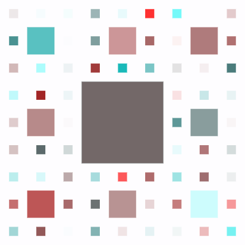
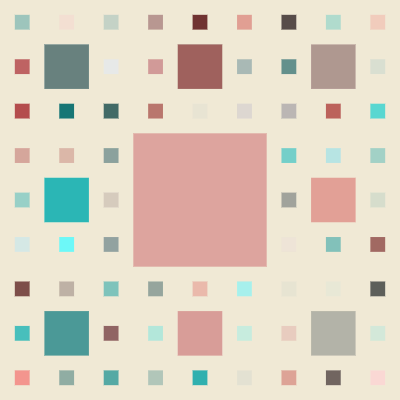
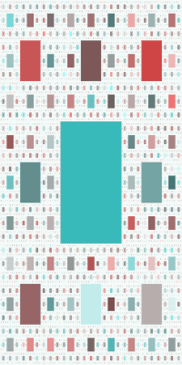

# Sierpinski Carpet Fractal

This project is an implementation of the **Sierpinski Carpet**, a classic fractal pattern, using JavaScript and the **p5.js** library. The Sierpinski Carpet is created by recursively dividing a square into 9 smaller squares and removing the center one. This process is repeated for each remaining square, resulting in a self-similar and intricate pattern.

This repository is an educational project created with the goal of learning and practicing programming concepts and algorithms. The main purpose of this project is to gain experience and new knowledge in the following areas:

- **Implementing a Stack**: In this project, a stack data structure is used to manage different parts of the fractal.

- **Depth-First Search (DFS) Algorithm**: Using the stack, a pseudo-recursive algorithm is implemented, which behaves similarly to depth-first search.

- **Fractals and Recursive Geometry**: This project helps in better understanding fractals and how self-similar patterns are generated.

## How to Run
This project is written using the p5.js library. To run the code, follow these steps:

1. Download the project files.

2. Use a local server (such as Live Server) to run the **index.html** file.

3. The result will be a Sierpinski Carpet fractal drawn on the screen.

## What I Learned
While working on this project, I learned about the following concepts:

- How to implement and use a stack in JavaScript.

- Using pseudo-recursive algorithms to solve problems.

- Better understanding of fractals and self-similar patterns.

- Working with the **p5.js** library for graphical rendering.

## Final Notes

This project was created as a personal exercise with the goal of learning. The code may not be optimized or may have imperfections, but I put in my best effort to expand my knowledge along the way. If you have any suggestions for improving the code or the explanations, I would be happy to hear your feedback.
